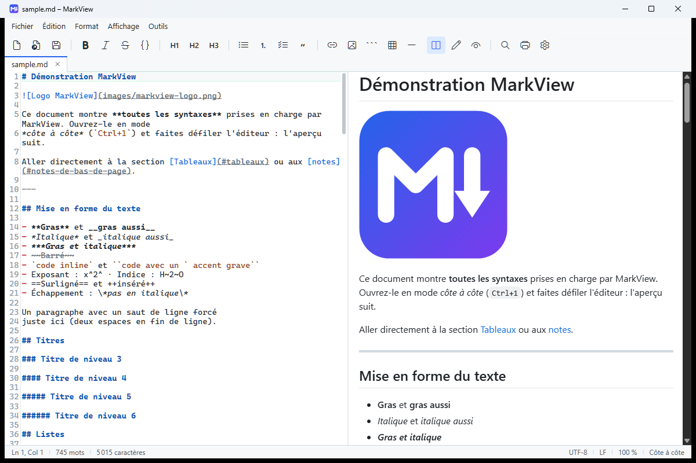
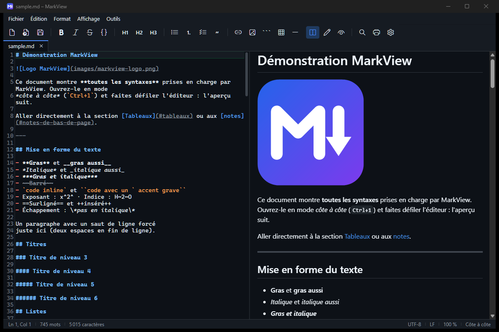

  

<h1 align="center">MarkView</h1>

  <strong>A simple, free and offline Markdown editor for Windows.</strong> 
  Write on the left, see the result on the right. That's it.

  
  
  

  <a href="README.md">🇫🇷 Français</a> · 🇬🇧 English

---

> The application's interface is in French. Menus and buttons all show icons and keyboard shortcuts, so it
> remains easy to use without speaking French.

## Why MarkView?

I needed a **simple** tool to read and write my Markdown (`.md`) files on Windows, and I couldn't find a
**free** one that suited me: too heavy, too complicated, paid, or dependent on the Internet. So I built
MarkView to solve this personal problem, and I'm sharing it for anyone who has the same need.

## Download and run

1. Go to the **[Releases](https://github.com/Nallraen/MarkView/releases/latest)** page.
2. Download **`MarkView.exe`** (or directly: **[MarkView.exe](https://github.com/Nallraen/MarkView/releases/latest/download/MarkView.exe)**).
3. Double-click it. Done: **no installation**, nothing else to download.

You can keep `MarkView.exe` anywhere (Desktop, `Documents`, USB stick…).

> [!NOTE]
> **Windows says "Windows protected your PC"?** That's normal for a small free program without a paid
> code-signing certificate. Click **More info**, then **Run anyway**. You'll only see it once.

There's also a "light" version (3 MB): who is it for?

`MarkView-light.exe` does exactly the same but requires the
[.NET 10 Desktop Runtime](https://dotnet.microsoft.com/download/dotnet/10.0) (x64) to be installed.
If you don't know what that is, just take `MarkView.exe`.

## What MarkView does

- ✍️ **Colored editor**: headings, bold, lists, code… are highlighted as you type.
- 👀 **Live preview**, updated while you type, scrolling along with your text.
- 🖼️ **Images, tables, task lists, footnotes, syntax-highlighted code blocks**.
- 🗂️ **Several files in tabs**, reopened the next time you start the app.
- 🧰 **Formatting toolbar**: bold, italic, headings, lists, links, images, tables…
- 🔎 **Find / Replace** with options (match case, whole word, regular expressions).
- 🌗 **Light, dark or automatic theme** (follows your Windows setting).
- 📤 **HTML and PDF export, printing, copy as HTML** to paste into an e-mail or a document.
- 🔒 **100% offline**: nothing is sent over the Internet, your files stay on your PC.
- 💾 **Safe**: warns you before closing an unsaved file and reloads a file changed by another program.

Three layouts: **side by side** (`Ctrl+1`), **editor only** (`Ctrl+2`) or **reading only** (`Ctrl+3`).

## Open `.md` files with MarkView on double-click

1. Right-click any `.md` file, then **Open with** → **Choose another app**.
2. Click **Choose an app on your PC** (or "Look for another app") and select `MarkView.exe`.
3. Tick **Always use this app**, then confirm.

Tip: put `MarkView.exe` in its final location first. If you move it later, repeat these steps.

## Handy shortcuts

| Action | Shortcut |
|---|---|
| New / Open / Save | `Ctrl+N` / `Ctrl+O` / `Ctrl+S` |
| Bold / Italic / Link | `Ctrl+B` / `Ctrl+I` / `Ctrl+K` |
| Heading 1, 2, 3 | `Ctrl+Alt+1`, `Ctrl+Alt+2`, `Ctrl+Alt+3` |
| Find / Replace | `Ctrl+F` / `Ctrl+H` |
| Switch layout | `Ctrl+1` / `Ctrl+2` / `Ctrl+3` |
| Zoom | `Ctrl+mouse wheel`, `Ctrl+0` to reset |
| Print | `Ctrl+P` |
| Full screen | `F11` |

## FAQ

**Is it really free?**
Yes, for personal or noncommercial use (see [License](#license)).

**Does it run on Mac or Linux?**
No, MarkView is made for Windows 10 and 11 only.

**The preview says the WebView2 runtime is missing?**
The preview relies on a Windows component (WebView2), built into Windows 11 and most up-to-date Windows 10 PCs.
Otherwise, the message shows a link to install it for free. The editor works even without it.

**Where are my settings? How do I uninstall?**
Settings live in `%AppData%\MarkView`, temporary files in `%LocalAppData%\MarkView`. To uninstall, delete
`MarkView.exe` and these two folders. MarkView writes nothing else on your PC.

**How can I see everything it can display?**
Open this repository's [`sample.md`](sample.md): it uses every supported syntax.

## Contributing

Ideas, bug reports and code contributions are welcome:

- found a bug or have an idea? Open an **[Issue](https://github.com/Nallraen/MarkView/issues)**;
- want to change the code? **Fork** the project and open a **pull request**, see [CONTRIBUTING.md](CONTRIBUTING.md);
- technical documentation (build, architecture, in French): [docs/DEVELOPPEMENT.md](docs/DEVELOPPEMENT.md).

## License

MarkView is released under the **[PolyForm Noncommercial License 1.0.0](LICENSE.md)**. In plain words:

| ✅ Allowed | ❌ Forbidden |
|---|---|
| Using MarkView for free (individuals, nonprofits, schools…) | **Any commercial use** |
| Copying, sharing, forking the project | Selling MarkView or a modified version |
| Modifying the code and sending pull requests | Including MarkView or its code in a commercial product or service |

Any copy or modified version must keep this license and credit the original author.
MarkView is provided "as is", without warranty.

MarkView builds on great open-source projects (Markdig, AvalonEdit, highlight.js…), which keep their own
licenses: see [THIRD-PARTY-NOTICES.md](THIRD-PARTY-NOTICES.md).
